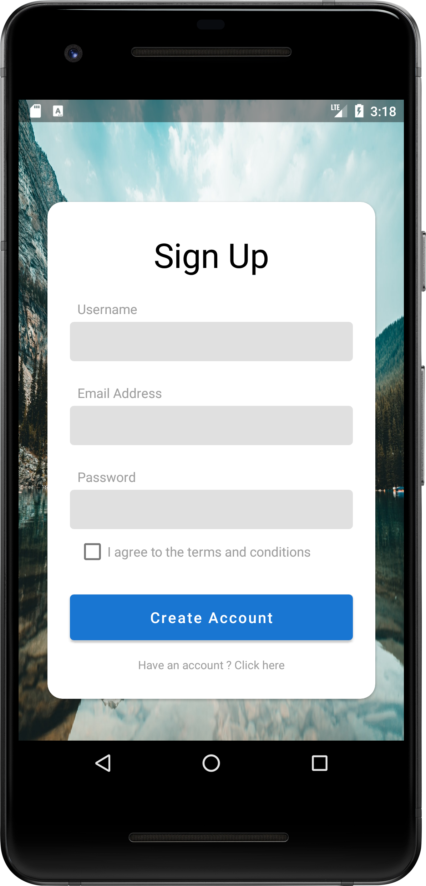
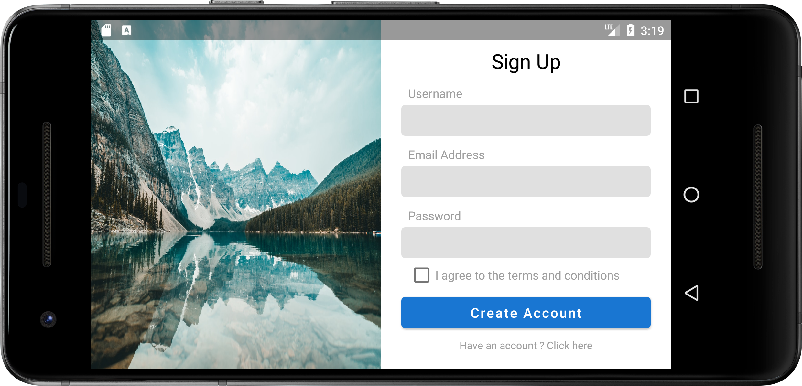

# SignMeUp
Basic sign up screen making use of portrait and landscape layouts

A really basic playground to play around with portrait and landscape layouts and some styling

# Summary
This is just a basic project for messing around with portrait and landscape layouts, nothing more :) 

# How it's done
The project doesn't have any functionality and is entirely UI based.

The app makes use of constraint layout and features already provided by android to handle changes in orientation automatically.

# How would you run this ? 

You can simply clone this from github and open the project using android studio (the `master` branch is usually where the latest stable build can be found, `dev` is where I work on new features)  there shouldn't be any additional requirements or configurations needed.

# Attribution
Photo by <a href="https://unsplash.com/@bantersnaps?utm_source=unsplash&amp;utm_medium=referral&amp;utm_content=creditCopyText">bantersnaps</a> on <a href="https://unsplash.com/s/photos/canada-nature?utm_source=unsplash&amp;utm_medium=referral&amp;utm_content=creditCopyText">Unsplash</a>

